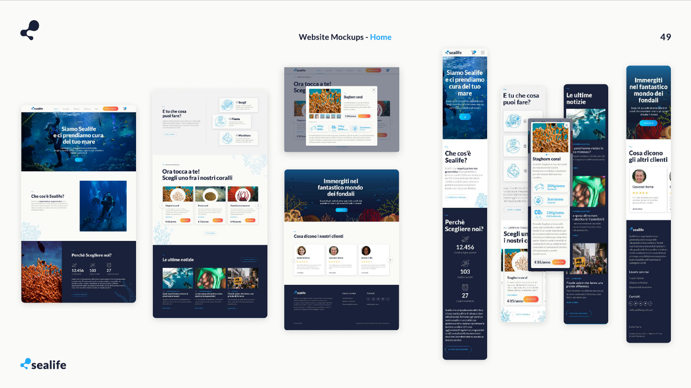
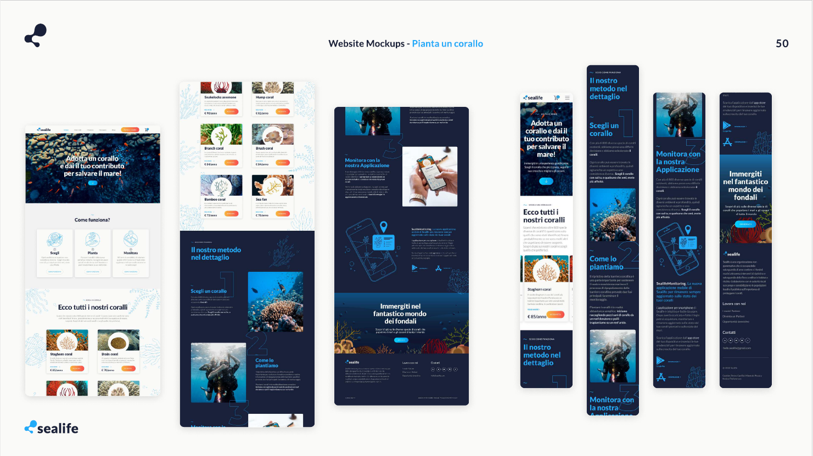

# Website-sealife

<h2>Introduction </h2>
The project is about making a full responsive website as part of a university assignment. This website is an important part of the larger academic project, demonstrating the practical use of skills and knowledge.

<h2>Description</h2>
The website started as a Figma design (Wireframes and Mockups) and then was brought to life using HTML, CSS, Bootstrap5, and JavaScript. It's a frontend project only.

 
 
<b>Click this link to see and try the website</b>
 
http://sealife.chickenkiller.com/
 
<h2> Images </h2>

Screenshot1  
_________________________________________________________________________________________________
 

Screenshot2  
_________________________________________________________________________________________________
 

Screenshot3  
_________________________________________________________________________________________________
  

Screenshot4  
_________________________________________________________________________________________________
 

[Design System Here](Resources/DESIGNSYSTEM.pdf)
 
 
 
 
 
